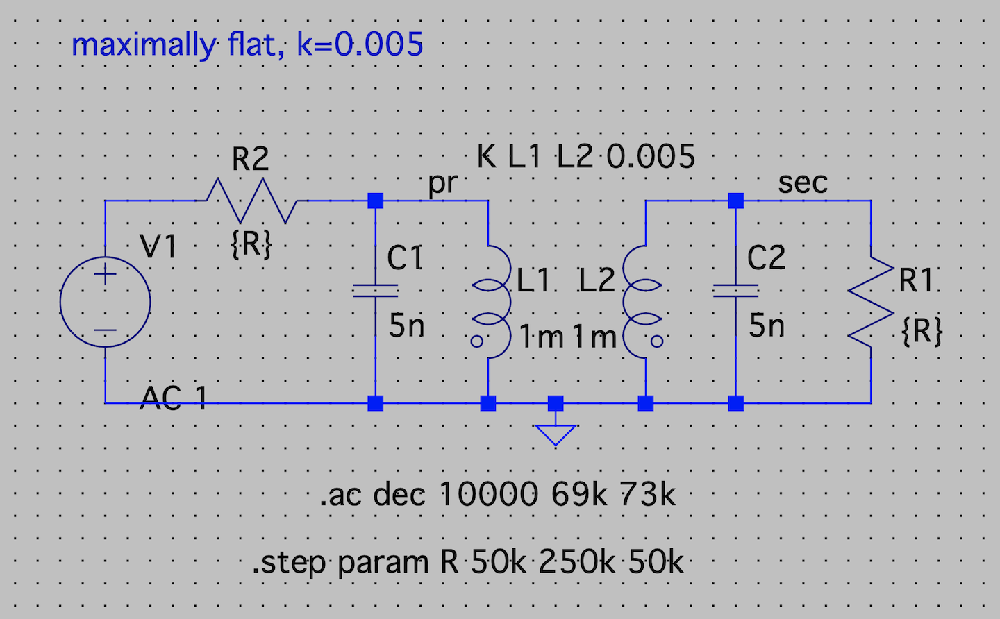
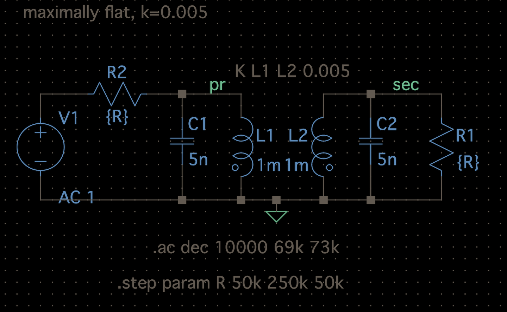
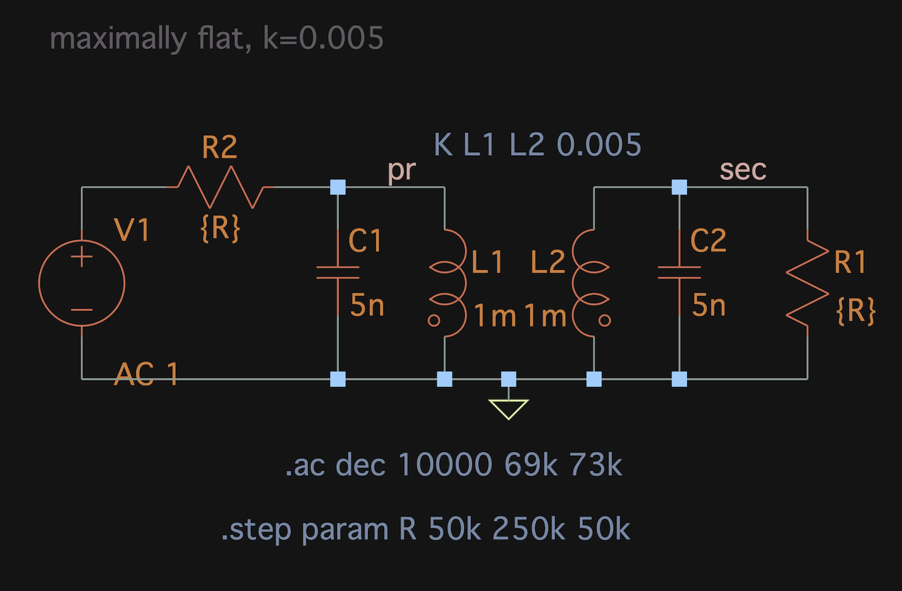
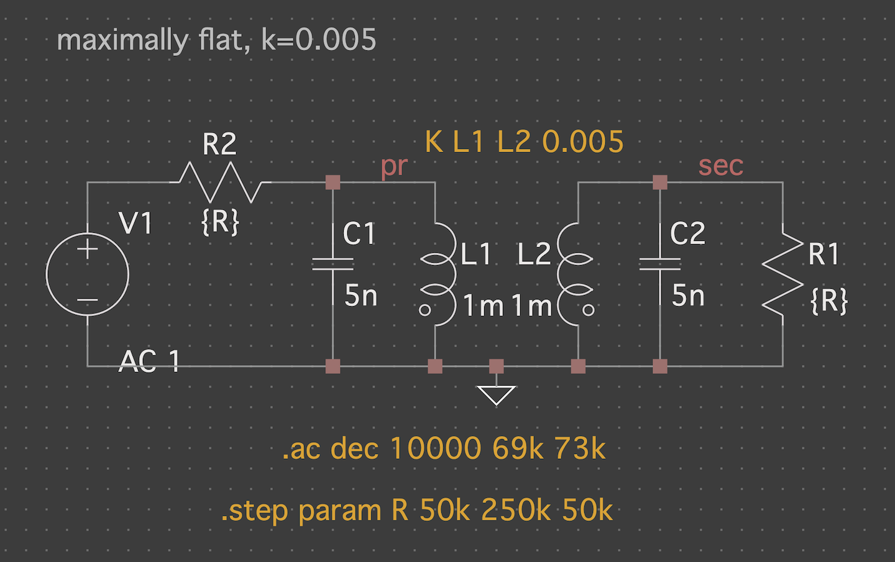
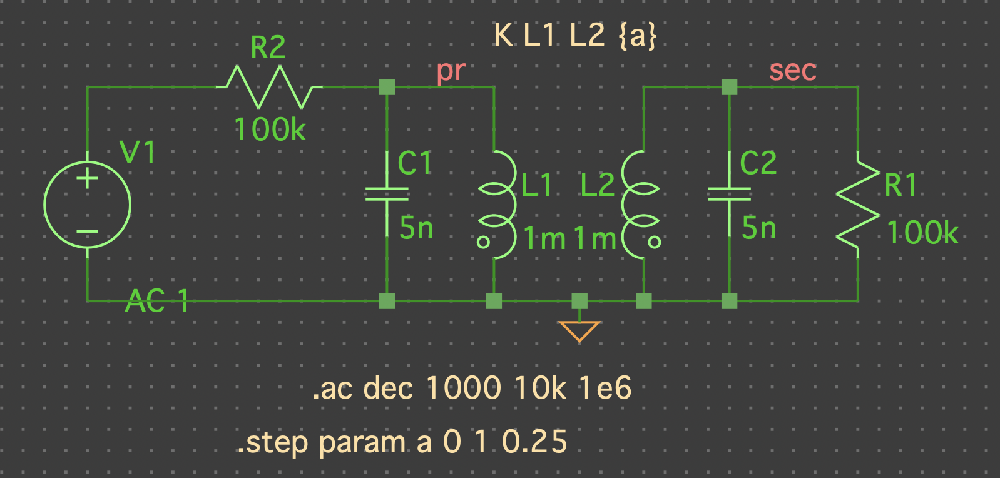
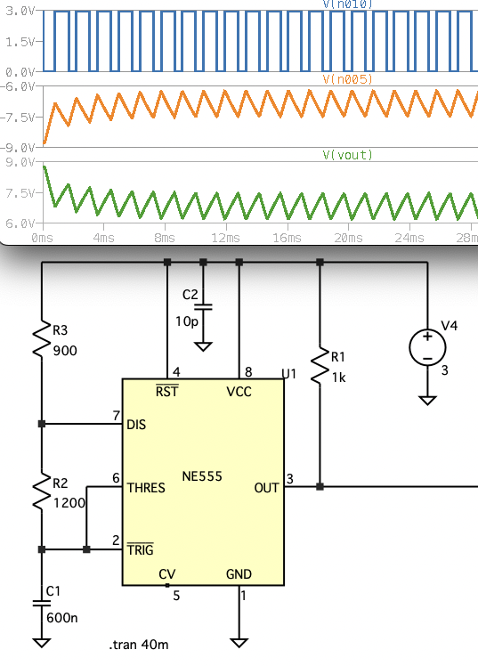

# README 'themeltspice.zsh'

`themeltspice.zsh` is a color theme manager for the **OSX** version of [LTSpice electric circuit simulator](https://www.analog.com/en/design-center/design-tools-and-calculators/ltspice-simulator.html) which is a version of the classical SPICE (*Simulation Program with Integrated Circuit Emphasis*) simulator.  
[LTSpice](https://www.analog.com/en/design-center/design-tools-and-calculators/ltspice-simulator.html) was written by **Mike Engelhardt** (now at [www.MarcusAureliusSoftware.com](www.MarcusAureliusSoftware.com)) and is made freely available by [Analog Devices](https://www.analog.com). This simulator is one of the fastest and numerically most robust circuit simulator currently available - and it is free!

&nbsp;

# Quickstart &lt;TL;DR>

The absolute easiest installation is to use the [Homebrew package manager](https://brew.sh/) for OSX. 

```
$> brew tap johan162/themeltspice
$> brew install themeltspice
```

This will install `themeltspice.zsh` in `/usr/local/bin`, and give you automatic updates
in the future via Homebrew update/upgrade function. 

Alternativly you can manually copy `themeltspice.zsh` to a directory of your choice.


## Usage

1. To list available themes run:  
```$ themeltspice.zsh -l```  

2. To use a new theme with **LTSpice**, say '```dracula```', run:  
```$ themeltspice.zsh dracula```

When you now run **LTSpice** you will see that the color palette has changed. You can see [examples of all available themes](#theme-reference-screenshots) as well. 

That is all there is to it for the most basic use case. Read on if you want to know more!

<div class="page"/>

&nbsp;

# Content

- [Introduction](#introduction)
- [Installation](#installation)
- [Usage](#usage) 
- [Upgrading](#upgrading) 
- [How the script works](#how-the-script-works)
- [Theme file format](#theme-file-format)
- [Theme reference screenshots](#theme-reference-screenshots)


&nbsp;

# Introduction
|[back to content table](#content)|

This is not meant to be an introduction to either the usage or function of 
the electric circuit simulator **LTSpice**. 
It is therefore assumed you have installed and have basic knowledge of the **OSX** version of **LTSpice**.

>**Note:** This theme manager is unique to **OSX** and will not in any shape or form work  on a the Window version of **LTSpice**. Instead see 
[Windows **LTSpice** theme manager](https://github.com/sakabug/LTspice-themes/blob/main/LTspice-themes.txt) 
if you are looking for a Windows based **LTSpice** theme manager.

This script is used to create and set a color theme for the **OSX** version of **LTSpice**. 
The themes are stored as a plain text file in an human readable format 
(see the [BNF grammar](#theme-file-format) at the end of this README file).

While **LTSpice** does not inherently support any concept of a color theme the color settings
are stored in an **OSX** standard property list (plist) configuration file that can be updated outside the **LTSpice** program. To avoid race conditions the **LTSpice** application needs to be closed when a theme change is made. This is checked by this script and if a running process is found an error message will be shown and the script terminates.


**A note on the **OSX** version of LTSpice:** 

In online forums there have been many complaints about the OSX version of LTSpice that comes from a lack of knowledge which needs to be addressed.

While all the core functionality of the simulator are exactly the same
between the **OSX** and Window version **the UI is dramatically different**. 
In fact, many **OSX** users are so stumped by the apparent frugality of the **OSX** UI that they end up using the Windows version even on **OSX** by running it under Wine. 

This is a mistake coming from lack of understanding. The **OSX GUI is highly functional and efficient** but, it is different than the Windows version.

While the **OSX** version does not adhere to the usual design guidelines for **OSX** programs
and requires some "getting used to" it is a highly functional UI for its purpose. After the initial "getting-used-to" experience many users will hopefully realize that the **OSX** version is superior for professionals 
(or even serious amateurs) compared to the window version. This has mainly to do with the abandonment of menus (in the OSX version) that distract the user and forces eye-focus to shift.

Both the advantage and the drawback of the **OSX** UI is that it heavily relies on 

1) the user getting familiar and learning a few important function keys (F2-F8) and,  
2) becoming familiar with context-sensitive menus (right-click) 

Once those keystrokes are
mastered it is usually substantially faster to create a circuit diagram and set up a simulation
in the native **OSX** version than the Windows dito. 

The **OSX** version does have some missing functionality in the UI compared with the Windows version. The main *functional* differences are:

1. No dialogue help to enter '```.meas```' simulation command so this has to be entered manually.   
Since this could be considered an "advanced" analysis command anyone using this is likely to know (or can easily find out) the syntax to enter this command directly.

1. Not possible to edit '```.op```' (operation point) labels to, for example, change from the default voltage display to current through an element or perhaps change the number of decimals shown in the diagram on an '```.op```' label. This is likely to be the only missing feature that might irritate primarily students of EE. 
   > **Theoretically**, this could be manually adjusted in the net-list file directly (since it is a text-file) but for anything other than basic textbook-examples this is hardly feasible or very error-prone.
 
1. No keyboard shortcut editor (a very little, or never, used functionality in our experience)


**Why do this as a shell script?**

*"Why, oh why was this done as a `zsh`"*,  someone might argue.  
Couldn't it be written in [select favourite language] ?. Of course, it could. However, `zsh` is the lowest common denominator on OSX that doesn't rely on any dependencies. One guiding principle in writing this has been that the script should run out of the box on any OSX system. Using a self-contained shell script is an easy way to achieve this, and we claim it is perfectly possible to write readable, medium-complex scripts using `zsh`. 


**Related work**

The inspiration for this work comes from the [Windows **LTSpice** theme manager](https://github.com/sakabug/LTspice-themes/blob/main/LTspice-themes.txt). While this script is widely different in both function, form and implementation the drive to write this came out of friendly *"jealousy"* that the windows world had this but not the **OSX** world. That state of affairs cannot stand and has now been corrected!

<div class="page"/>
&nbsp;

# Installation

|[back to content table](#content)|

## Using Homebrew

The absolute easiest installation is to use the Homebrew package manager for OSX. 

```
$> brew tap johan162/themeltspice
$> brew install themeltspice
```

This will install `themeltspice.zsh` in `/usr/local/bin` which you can verify as so:

```
$> which themeltspice.zsh
/usr/local/bin/themeltspice.zsh
```

> **Tip:** Use `alias` to get a shorter command, for example adding   
  `$> alias ltt="/usr/local/bin/themeltspice.zsh"`  
to your `.zshenv` will let you use `ltt` as the command name. 


## Direct copy

There is no installation program for this since it is only one executable script file, and you are free to place that file anywhere at your convenience. 

To use the script either copy the script (```themeltspice.zsh```) to some standard location for scripts as per your ```PATH``` variable or create a new directory and copy the file there and run it from this directory.

The script uses the default location of "```~/.ltspice_themes```" to store the theme file as well as a backup file of **LTSpice** original plst file when you first run the theme script. If the directory does not exist it will be created the first time you run the script. If no theme file exist a default theme file with six themes will be automatically installed.

The default theme file is named  "```themes.ltt```". The file-extension of this can be read as "**LT**Spice **T**hemes". By using the "```-f```" option you can also specify another file location to be used a theme file. 

<div class="page"/>

This default theme file installed (as of this writing) contains these six themes:

1. "default" (**LTSpice** default)
2. "sakabug"
3. "twilight-after-dawn"
4. "dracula"
5. "softdark"
6. "blackwhite"
7. "redblack"
8. "bbking"
9. "blackred"
10. "darkgreen"
11. "matlab"

Themes no 2-4 are taken directly from the [Windows **LTSpice** theme manager](https://github.com/sakabug/LTspice-themes/blob/main/LTspice-themes.txt). The theme "softdark" is an additional different theme I personally like to use. The last theme "blackwhite" is especially suitable when printing a circuit diagram.

Later on if you find themes you like somewhere else just open the theme file and copy them at the end with one blank line between the new theme and the last existing theme.

You can easily check if the new theme have been added correctly by listing the theme with the command:

    $> themeltspice.zsh -l


## Known Limitations

- Neither theme files nor **LTSpice** configuration files are compatible between the **OSX** and **Window** version.  *C'est la vie!*  
*(However, it is not terrible hard to manually fix those few differences and then copy a theme definition as hinted in the section "[Theme file format](#theme-file-format)")*

<div class="page"/>
&nbsp;

# Usage

|[back to content table](#content)|

```
Set or create a named color theme for LTSpice
Usage:
%themeltspice.zsh [-f <FILE>] [-d] [-l] [-h] [-p] [-q] [-v] [-x <THEME>] [-y] [<THEME>]
-d          : Dump current plist to default or named theme file as specified theme
-f <FILE>   : Use the specified file as theme file
-h          : Show help and exit
-l [<NAME>] : List themes in default or named theme file or íf <NAME> is specified check if <NAME> theme exists
-p          : List content in LTSpice plist file
-q          : Quiet, no status output
-V          : Verbose status output
-v          : Show version and exit
-x <NAME>   : Delete theme NAME from themes file
-y          : Force 'yes' answer to any interactive questions (e.g. deleting theme)
```

There are two major use cases:

1. Set a new theme to be used the next time **LTSpice** is run
2. Save an existing color configuration you have made as a new theme

In addition to these major use cases there are some supporting function that are available

- List the names of all defined themes in a specific themes file
- Check if a specified theme exists
- Print the **LTSpice** binary configuration file in a human-readable format

&nbsp;

> **Note:** A copy fo the original **LTSpice** property list (plist) configuration file is also stored in the theme directory with the extension "```*.ORIGINAL```". In case the configuration file gets corrupt you can always restore this as a clean backup. The backup file is created the first time you run the script or if it is ever deleted.


> **Tip:** If you ever mess up the themes file and want to restore it to the default then the easiest way is to just delete the '```/User/<USER>/.ltspice_themes/themes.ltt```' file. The next time you run '```themeltspice.zsh```' it will be restored.

<div class="page"/>

## Setting a new theme for LTSpice

If we assume you have installed the script somewhere in your path (see [Installation](#installation) section above) you can now set the '```softdark```' theme as so:

```
$> themeltspice.zsh softdark
Successfully updated new theme to 'softdark'
``` 

This will update the current **LTSpice** configuration file with this color schema. If you now start **LTSpice** you will see the effect of this theme switch. To restore back to the default schema just do:

```
$> themeltspice.zsh default
Successfully updated new theme to 'default'
``` 

and there is nothing more to it. The settings are done in an atomic way so a change go through successfully or not at all. This way you cannot end up with a half-updated configuration file.

&nbsp;

> **Atomic update:** The way this is done is by first copying the config file to a temporary directory, do the changes, run a integrity verification on the config file and then copy it back to the application location (i.e. ```/Users/<USER>/Library/Preferences/com.analog.LTspice.App.plist)```)

&nbsp;

## Storing the current configuration as a theme

By first creating a color schema in **LTSpice** it can then be saved as a new theme. So if you want to store your current settings as the new theme, say, "```mytheme```" you use the "```-d```" (=dump) option as such

```
$> themeltspice.zsh -d mytheme
Dumping current color setup from 'com.analog.LTspice.App.plist' to '/Users/<USER>/.ltspice_themes/themes.txt' as theme 'mytheme'
```

This will store the new theme at the end of the existing theme file. If a theme with this name already exists an error message will be displayed informing about this.


<div class="page"/>
&nbsp;

> **WARNING:** If you update the script (see [Upgrading](#upgrading)) local changes will be overwritten. However, a backup file will be created which will allow you to manually merge any local changes into the newly created theme file.

&nbsp;

> **WARNING:** You might have to quit and start **LTSpice** twice to force the update of the plist file from the plist cache before running the dump command.  
You might want to check that changes have been made by printing out the property list using the command:  
```$ themeltspice.zsh -p```" (See [Printing all settings](#printing-all-settings-stored-in-the-config-file))

&nbsp;

## Listing all themes available

To see a list of all themes defined use the "```-l```" option as so:

```
$> themeltspice.zsh -l 
Listing themes in '/Users/<USER>/.ltspice_themes/themes.txt''
 1. default
 2. sakabug
 3. twilight-after-dawn
 4. dracula
 5. softdark
 6. blackwhite
 7. redblack
 8. bbking
 9. blackred
 10. darkgreen
 11. matlab
```

### Checking if a named theme exists

Use the '```-l```' option with a theme name

```
$> themeltspice.zsh -l mytheme
*** ERROR *** Theme 'mytheme' DOESN'T exists in '/Users/<USER>/.ltspice_themes/themes.ltt'
```

or

```
$> themeltspice.zsh -l default
Theme 'default' exists in '/Users/<USER>/.ltspice_themes/themes.ltt'
```

<div class="page"/>

## Printing all settings stored in the config file

To see the complete configuration file (and not only the color settings) use the "```-p```" (=print) that will dump **LTSpice** full property list file to stdout as in:

```
$> themeltspice.zsh -p
'/Users/<USER>/Library/Preferences/com.analog.LTspice.App.plist' content:{
  "AllowShortedCompPins" => 0
  "AutoDotRawDeletion" => 1

  ...

  "WaveColor11" => 12237492
  "WaveColor12" => 255
  "WaveColor13" => 16748287
}
```

## Deleting a theme

To delete a theme use the '```-x```' option. For example, to delete the theme '```softdark```' do the following:

```
$> themeltspice.zsh -x softdark
Are you sure you wish to delete theme 'softdark' in '/Users/ljp/.ltspice_themes/themes.ltt'?
1) Yes
2) No
#? 1
Theme 'softdark' have been deleted from '/Users/<USER>/.ltspice_themes/themes.ltt'
```
As a safety precaution the deletion of a theme have to be confirmed by an interactive question. To avoid this question and delete directly (perhaps in a script) add the '```-y```' option as so:

```
$> themeltspice.zsh -xy softdark
Theme 'softdark' have been deleted from '/Users/<USER>/.ltspice_themes/themes.ltt'
```

A one-level backup file is always created with the name '```themes.ltt.BAK```' in the themes directory.

By combining the '```-x```' option with '```-v```' option (verbose) the script will also print out the theme before being deleted.

> **Note:** if you want to update (write over) an existing theme you must first delete it. This is done on purpose to avoid unintentional data loss.

<div class="page"/>

&nbsp;


# Upgrading

|[back to content table](#content)|

If the script is updated either by manually by downloading a new version or via `brew upgrade` the script will also update the theme file. If there is a difference then the existing theme file will be backed up to `themes.ltt.original`. 

Unfortunately there is no easy (and robust) way to merge potential local additions/deletions to the theme file with an updated distributed theme file in the new version. This would require a 3-way merge, and it would add a lot of complexity. Very few would need that so the 80/20 rule apply.

If there are local modification they will have to be manually re-applied in the new theme file. An alternative is to send new themes as a suggestion to be included in the official distribution.


<div class="page"/>


# How the script works

|[back to content table](#content)|

The configuration file where the **LTSpice** configurations are stored
is a binary configuration file and cannot be directly manipulated. The format
used is a standard **OSX** *"Property List"* (plist) and as such **OSX** provides a
command line tool that can be used to manipulate the individual fields in that
property file.

The **OSX** utility is called '```plutil```' and is used to read and manipulate individual 
fields in this configuration file. See ```man plutil``` for more details.

By default the plist configuration file of **LTSpice** is stored at:

    /Users/<USER>/Library/Preferences/com.analog.LTspice.App.plist

Since **LTSpice** updates this file at least on every exit the simulator must be closed before
running this script. This is also checked in the script and an error message is shown
if any running copies are detected. 

As an extra precaution the first time the script is run it creates a backup copy of the
configuration file and stores it in the theme directory with the added suffix 
"```.ORIGINAL```".

Since **OSX** caches all plist files it is not enough to just update the property file
on its own, one must also force a refresh of the property cash using "```default read <PLIST-FILE>```" command. 


## Directories and files used

- '```/User/<USER>/.ltspice_themes/themes.ltt```'  
The default location of themes

- '```/User/<USER>/.ltspice_themes/com.analog.LTspice.App.plist.ORIGINAL```'  
Copy of the **LTSpice** application plist file at the time of first run of this script

- '```/Users/<USER>/Library/Preferences/com.analog.LTspice.App.plist```'  
**LTSpice** application plist file

<div class="page"/>

# Theme file format

|[back to content table](#content)|

## Stored color fields

For each theme a total of 34 color parameters are stored as listed in figure 1 below. 

```
GridColor
InActiveAxisColor
WaveColor0
WaveColor1
WaveColor2
WaveColor3
WaveColor4
WaveColor5
WaveColor6
WaveColor7
WaveColor8
WaveColor9
WaveColor10
WaveColor11
WaveColor12
WaveColor13
SchematicColor0
SchematicColor1
SchematicColor2
SchematicColor3
SchematicColor4
SchematicColor5
SchematicColor6
SchematicColor7
SchematicColor8
SchematicColor9
SchematicColor10
SchematicColor11
SchematicColor12
NetlistEditorColor0
NetlistEditorColor1
NetlistEditorColor2
NetlistEditorColor3
NetlistEditorColor4)
```

***Fig 1: The fields stored as a color theme***

<div class="page"/>

## BNF Grammar
The BNF grammar for the theme file is simple and is shown in Figure 2. below

```
themes        ::= theme | theme <EMPTY_LINE> themes
theme         ::= theme_comment '[' theme-name ']' <NL> fields
theme_comment ::= "" | alnum <NL>
fields        ::= field | field <NL> fields
field         ::= fieldname '=' digits
fieldname     ::= "" | alnum fieldname
alnum         ::= "A" | "B" | ...
digits        ::= "0" | "1" | ...
 ```
***Fig 2: The simplified BNF grammar for the themes file format***

&nbsp;

## Difference between **OSX** the Windows version theme format

Unfortunately there are a couple differences between the Window and **OSX** version of **LTSpice**. 
These changes also impact the theme files in the following three ways:

1. **OSX** uses the name "```GridColor```" while the windows version call it "```Grid```".  

2. **OSX** uses the name "```InActiveAxisColor```" while the Windows version  call it "```InActiveAxis```".   

3. The window version have one additional schematic color setting which is the *"Graphic Annotation"* color which does not exist in the **OSX** version. This means that the window version have schematic colors 0-13 and the **OSX** version 0-12. In practice this means that the color "```SchematicColor13```" (which is the graphic annotation color) doesn't exist in the **OSX** version.  

For the above reason it is not possible to copy themes directly between the Window and **OSX** version of **LTSpice** without manual conversion adressing the issues above. 

&nbsp;

<div class="page"/>

# Theme reference screenshots

|[back to content table](#content)|

## 1. Theme: "default"



<div class="page"/>

## 2. Theme: "dracula"


## 3. Theme: "sakabug"



<div class="page"/>

## 4. Theme: "twilght-after-dark"



## 5. Theme: "softdark"



<div class="page"/>

## 6. Theme: "blackwhite"


## 7. Theme: "redblack"


<div class="page"/>

## 8. Theme: "bbking"


## 9. Theme: "blackred"


## 10. Theme: "darkgreen"



## 11. Theme: "matlab"

Note: Very close to the *blackwhite* theme but light yellow components and full colors for plots. Credit: "owiecc" from the EEVblog.

